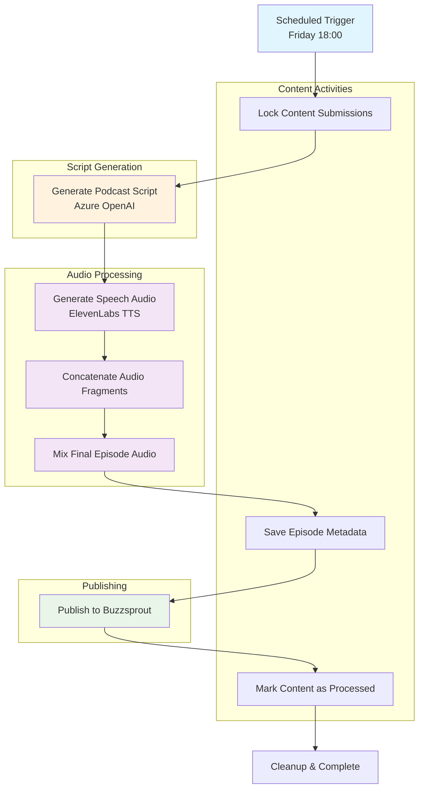

# Podcast API

The Podcast API is responsible for generating the weekly podcast API. The Podcast API
uses an LLM to generate a podcast script. It generates podcast audio with ElevenLabs and
publishes the final result through Buzzsprout.

## Temporal Workflow

The podcast generation process is orchestrated using Temporal workflows, scheduled to run every Friday at 18:00:



**Workflow Steps:**
1. **Content Locking** - Prevents duplicate processing of submissions
2. **Script Generation** - Uses Azure OpenAI to create podcast script from content
3. **Audio Generation** - Converts script to speech using ElevenLabs TTS
4. **Audio Processing** - Concatenates and mixes audio fragments
5. **Episode Publishing** - Saves metadata and uploads to Buzzsprout
6. **Cleanup** - Marks content submissions as processed

## Technical Requirements

- [Java SDK 21](https://bell-sw.com/pages/downloads/#jdk-21-lts)
- [Docker](https://www.docker.com/products/docker-desktop/) or [Podman](https://podman.io/) (for database)
- [Maven](https://maven.apache.org/) (or use the included Maven wrapper)

Optional:

- [Quarkus CLI](https://quarkus.io/guides/cli-tooling) for enhanced development experience

## Running the API in Development Mode

You can run the Content API in development mode using either the Quarkus CLI or Maven:

### Using Quarkus CLI (recommended)

```bash
quarkus dev
```

### Using Maven

```bash
./mvnw quarkus:dev
```

In development mode, the API will:

- Enable live coding with automatic reload on code changes
- Start with an in-memory H2 database for testing
- Provide a GraphQL UI at `http://localhost:8080/q/graphql-ui`
- Offer the Quarkus Dev UI at `http://localhost:8080/q/dev/`

## Running Tests

To run all tests including unit and integration tests:

```bash
mvn verify
```

To run only unit tests:

```bash
mvn test
```

## Directory Structure

The Content API follows a clean architecture approach with the following structure:

```
src/main/java/nl/fizzylogic/newscast/reader/
├── clients/           # Clients used to connect to other services
├── processing/        # Components used in the podcast generation process
├── model/             # Domain models and entities
└── service/           # Business logic and service implementations

src/main/resources/
└── application.properties  # Configuration settings

src/test/java/         # Unit and integration tests
```
