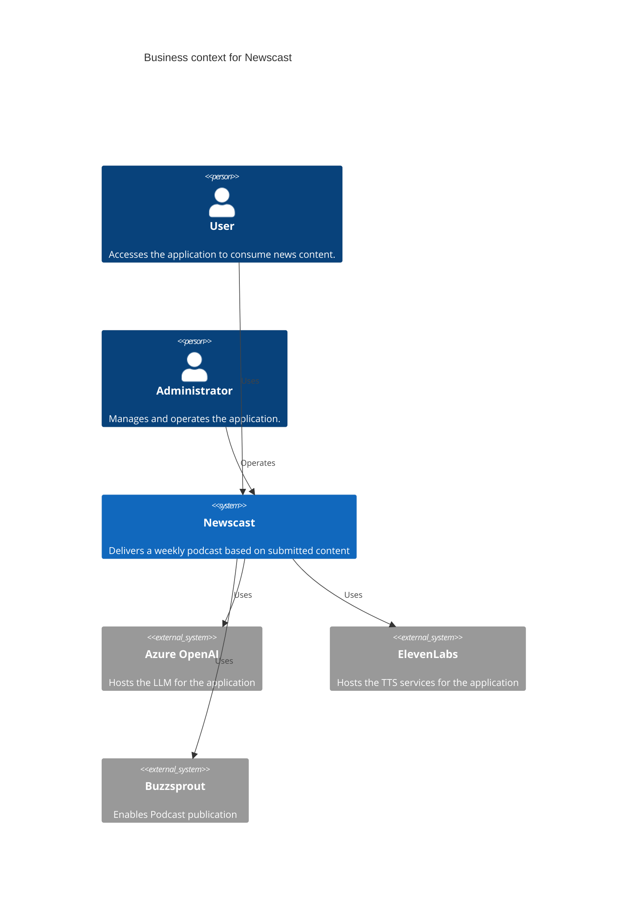

# Context and scope

This section lists the context and scope for the solution. Use this section to learn
more about external interfaces that the solution connects with.

## Business context

## Technical context

