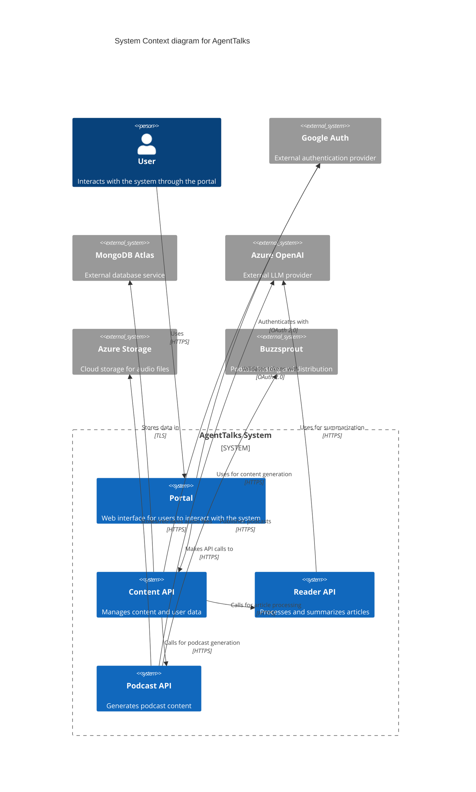

# Context and scope

This section describes the context and scope of the system. Please find the context
diagram below.

```mermaid
C4Context
    title System Context diagram for AgentTalks

    Person(user, "User", "Interacts with the system through the portal")

    System_Boundary(system, "AgentTalks System") {
        System(portal, "Portal", "Web interface for users to interact with the system")
        System(content_api, "Content API", "Manages content and user data")
        System(reader_api, "Reader API", "Processes and summarizes articles")
        System(podcast_api, "Podcast API", "Generates podcast content")
    }

    System_Ext(google_auth, "Google Auth", "External authentication provider")
    System_Ext(mongodb, "MongoDB Atlas", "External database service")
    System_Ext(openai, "Azure OpenAI", "External LLM provider")
    System_Ext(azure_storage, "Azure Storage", "Cloud storage for audio files")
    System_Ext(buzzsprout, "Buzzsprout", "Podcast hosting and distribution")

    Rel(user, portal, "Uses", "HTTPS")
    Rel(portal, content_api, "Makes API calls to", "HTTPS")
    Rel(content_api, mongodb, "Stores data in", "TLS")
    Rel(content_api, reader_api, "Calls for article processing", "HTTPS")
    Rel(content_api, podcast_api, "Calls for podcast generation", "HTTPS")
    Rel(reader_api, openai, "Uses for summarization", "HTTPS")
    Rel(podcast_api, openai, "Uses for content generation", "HTTPS")
    Rel(podcast_api, azure_storage, "Stores/retrieves audio files", "HTTPS")
    Rel(podcast_api, buzzsprout, "Publishes podcasts", "HTTPS")
    Rel(portal, google_auth, "Authenticates with", "OAuth 2.0")
    Rel(content_api, google_auth, "Validates tokens with", "OAuth 2.0")
```

## System Overview

The system consists of the following main components:

1. **Portal**: The web interface that users interact with to access the system's features.
2. **Content API**: Central API that manages user data, content, and orchestrates communication between other services.
3. **Reader API**: Handles article processing and summarization using Azure OpenAI.
4. **Podcast API**: Generates podcast content using Azure OpenAI's capabilities.

### External Dependencies

- **Google Auth**: Handles user authentication via Google accounts.
- **Azure OpenAI**: Provides LLM capabilities for content generation and processing.
- **MongoDB Atlas**: Cloud database service for persistent data storage.
