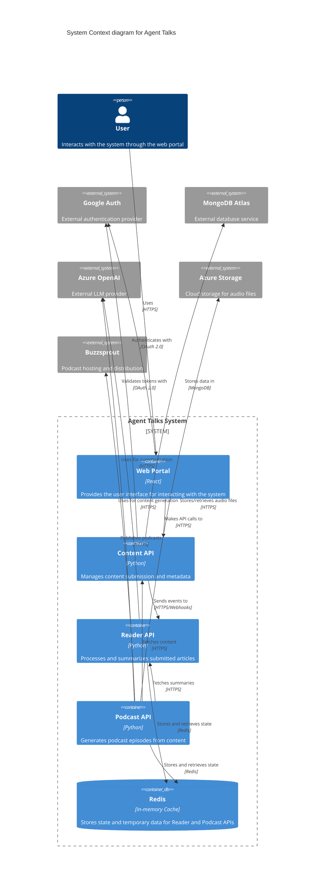

# Building block view

```mermaid
C4Container
    title System Context diagram for Agent Talks

    Person(user, "User", "Interacts with the system through the web portal")

    System_Boundary(system, "Agent Talks System") {
        Container(portal, "Web Portal", "React", "Provides the user interface for interacting with the system")

        Container(content_api, "Content API", "Python", "Manages content submission and metadata")
        Container(reader_api, "Reader API", "Python", "Processes and summarizes submitted articles")
        Container(podcast_api, "Podcast API", "Python", "Generates podcast episodes from content")

        ContainerDb(redis, "Redis", "In-memory Cache", "Stores state and temporary data for Reader and Podcast APIs")
    }

    System_Ext(google_auth, "Google Auth", "External authentication provider")
    System_Ext(mongodb, "MongoDB Atlas", "External database service")
    System_Ext(openai, "Azure OpenAI", "External LLM provider")
    System_Ext(azure_storage, "Azure Storage", "Cloud storage for audio files")
    System_Ext(buzzsprout, "Buzzsprout", "Podcast hosting and distribution")

    Rel(user, portal, "Uses", "HTTPS")
    Rel(portal, content_api, "Makes API calls to", "HTTPS")
    Rel(content_api, mongodb, "Stores data in", "MongoDB")

    Rel(content_api, reader_api, "Sends events to", "HTTPS/Webhooks")
    Rel(reader_api, redis, "Stores and retrieves state", "Redis")
    Rel(reader_api, openai, "Uses for summarization", "HTTPS")

    Rel(podcast_api, content_api, "Fetches content", "HTTPS")
    Rel(podcast_api, reader_api, "Fetches summaries", "HTTPS")
    Rel(podcast_api, redis, "Stores and retrieves state", "Redis")
    Rel(podcast_api, openai, "Uses for content generation", "HTTPS")
    Rel(podcast_api, azure_storage, "Stores/retrieves audio files", "HTTPS")
    Rel(podcast_api, buzzsprout, "Publishes podcasts", "HTTPS")
    Rel(portal, google_auth, "Authenticates with", "OAuth 2.0")
    Rel(content_api, google_auth, "Validates tokens with", "OAuth 2.0")
```

## Component Descriptions

### Web Portal

A React-based single-page application that serves as the main user interface for the
Agent Talks platform. It provides an intuitive interface for users to submit content,
view their submissions, and access generated podcasts. The portal communicates with the
Content API to manage content in the solution.

### Content API

A Python-based RESTful API that serves as the primary interface for content management.
It handles:

- Content submission and validation
- Metadata management
- Content retrieval and search
- User authentication and authorization
- Integration with MongoDB for persistent storage
- Event publishing for content-related actions

### Reader API

A Python service responsible for processing and analyzing submitted content.
Its main functions include:

- Asynchronous processing of new content submissions
- Text analysis and summarization
- Content classification and tagging

Processed content is sent back to the content API.

### Podcast API

A Python service that generates podcast episodes from processed content.
Features include:

- Scheduled content aggregation
- Text-to-speech conversion
- Audio file generation and storage

### Data Storage

- **MongoDB**: Primary database for the Content API, storing all content submissions,
  metadata, and user-related data in a flexible, schema-less format.
- **Redis**: In-memory data store used by Reader and Podcast APIs for caching, state
  management, and temporary data storage, providing high-performance data access.
