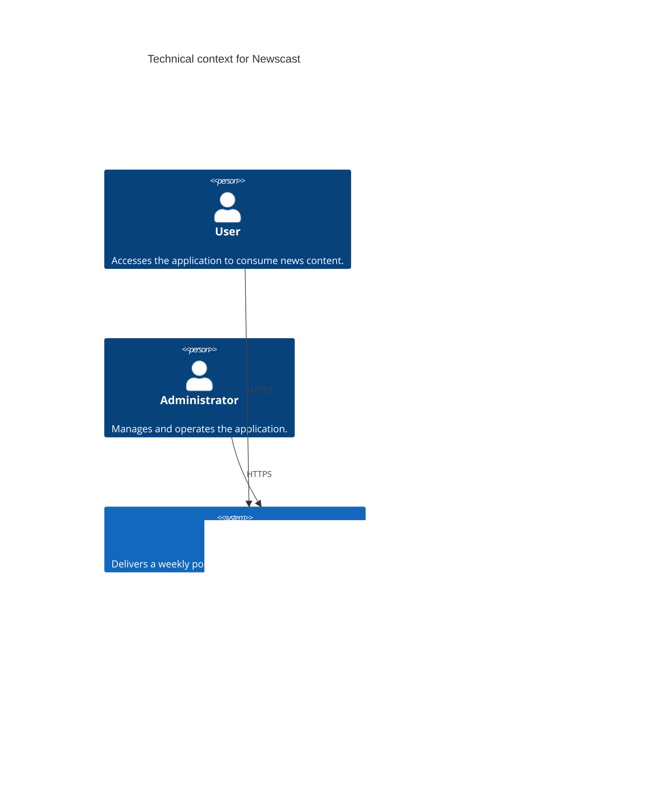

# Building block view

## System context

## Newscast services

| Name        | Description                                                   |
| ----------- | ------------------------------------------------------------- |
| Dashboard   | Provides insights into the current week and previous episodes |
| Content API | Stores collected content and generated podcast episodes       |
| Reader API  | Scrapes content and summarizes it for the upcoming podcast    |
| Podcast API | Generates the weekly podcast every friday at 6PM              |
| RabbitMQ    | Eventbus implementation for the application                   |
