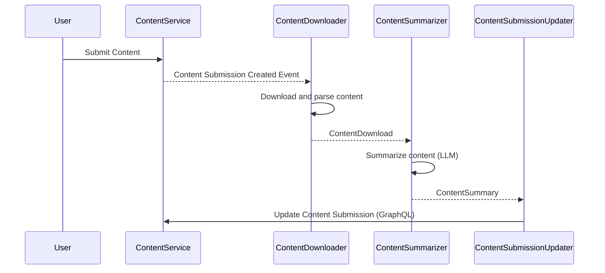

# Runtime view

## Summarization of submitted content

TODO: Describe how we collect user content, summarize it, and store the result.

## Generation of a weekly podcast

TODO: Describe how we generate a podcast each week.

## Processing Flow in reader-api

### Sequence Diagram

This sequence diagram illustrates the step-by-step flow of content processing in the `reader-api`, from user submission to updating the content service with the generated summary.

The `reader-api` is responsible for processing submitted content through a series of asynchronous steps, implemented as processing packages. The main flow is as follows:

1. **Content Downloading**
   - The `ContentDownloader` listens for new content submission events.
   - It downloads the content from the provided URL, parses it (using Tika), and emits a `ContentDownload` object containing the raw content and metadata.

2. **Content Summarization**
   - The `ContentSummarizer` receives the downloaded content.
   - It uses the `SummarizerAgent` (which leverages an LLM, e.g., Azure OpenAI) to generate a summary and actionable insights from the article body.
   - The result is emitted as a `ContentSummary` object.

3. **Content Submission Update**
   - The `ContentSubmissionUpdater` receives the summary.
   - It updates the original content submission in the content service via a GraphQL mutation, attaching the generated summary.

Each processing step is implemented as a Quarkus bean and connected via reactive messaging channels, enabling scalable and decoupled processing. Errors are logged and propagated as needed, and each step is designed to be idempotent and robust against transient failures.

This flow ensures that submitted content is automatically processed, summarized, and made available for further use (e.g., in podcast generation or user-facing summaries).
