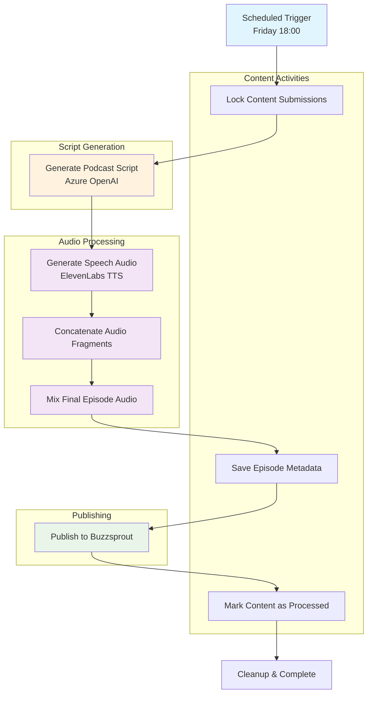
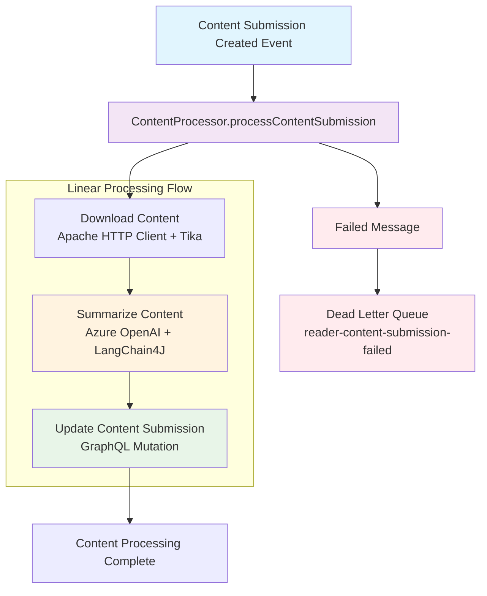

# Runtime view

## Generation of a weekly podcast

The podcast generation workflow is an automated process that runs weekly to create podcast episodes from summarized content submissions. The workflow is implemented using Temporal workflows for reliability and includes several stages from content selection to final publication.

### Workflow Overview

**Workflow Steps:**
1. **Content Locking** - Prevents duplicate processing of submissions
2. **Script Generation** - Uses Azure OpenAI to create podcast script from content
3. **Audio Generation** - Converts script to speech using ElevenLabs TTS
4. **Audio Processing** - Concatenates and mixes audio fragments
5. **Episode Publishing** - Saves metadata and uploads to Buzzsprout
6. **Cleanup** - Marks content submissions as processed

## Processing Flow in reader-api

The reader-api processes content submissions through a single linear processor that handles all three steps sequentially. This approach provides better retry control and simpler error handling while maintaining resilience through comprehensive fault tolerance mechanisms.

**Processing Steps:**
1. **Content Download** - Downloads and parses content from URLs using Apache HTTP Client and Tika (3 retries, 30s timeout)
2. **Content Summarization** - Uses Azure OpenAI via LangChain4J to generate title and summary (5 retries, 60s timeout)
3. **Content Update** - Updates the content submission in Content API via GraphQL mutation (3 retries, 15s timeout)

**Resilience Features:**
- **MicroProfile Fault Tolerance** - Each step has custom retry, timeout, and circuit breaker configurations
- **Dead Letter Queue** - Failed messages are sent to `reader-content-submission-failed` queue after all retries exhausted
- **Linear Processing** - Single processor eliminates intermediate message passing complexity
- **Step-specific Retry Logic** - Different retry strategies for network, AI service, and database operations

The linear approach simplifies debugging and maintenance while providing superior resilience through comprehensive fault tolerance patterns.
