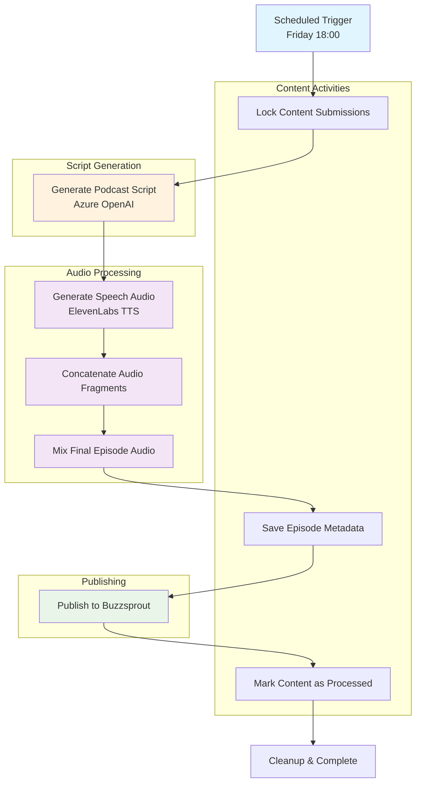
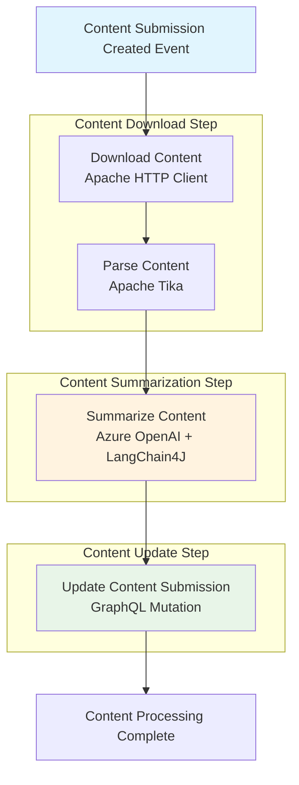

# Runtime view

## Generation of a weekly podcast

The podcast generation workflow is an automated process that runs weekly to create podcast episodes from summarized content submissions. The workflow is implemented using Temporal workflows for reliability and includes several stages from content selection to final publication.

### Workflow Overview

**Workflow Steps:**
1. **Content Locking** - Prevents duplicate processing of submissions
2. **Script Generation** - Uses Azure OpenAI to create podcast script from content
3. **Audio Generation** - Converts script to speech using ElevenLabs TTS
4. **Audio Processing** - Concatenates and mixes audio fragments
5. **Episode Publishing** - Saves metadata and uploads to Buzzsprout
6. **Cleanup** - Marks content submissions as processed

## Processing Flow in reader-api

The reader-api processes content submissions through a three-step event-driven pipeline using RabbitMQ messaging. Each step is implemented as a separate Quarkus bean with reactive messaging channels.

**Processing Steps:**
1. **Content Download** - Downloads and parses content from URLs using Apache HTTP Client and Tika
2. **Content Summarization** - Uses Azure OpenAI via LangChain4J to generate title and summary
3. **Content Update** - Updates the content submission in Content API via GraphQL mutation

The process is implemented using RabbitMQ reactive messaging with `@Incoming` and `@Outgoing` annotations for scalable, decoupled processing. Each step includes comprehensive error handling and retry logic for robust operation.
