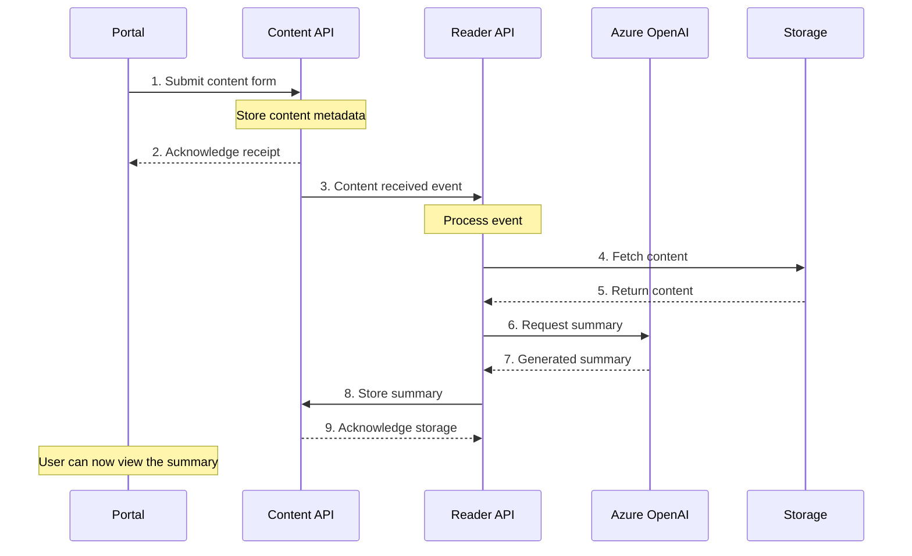
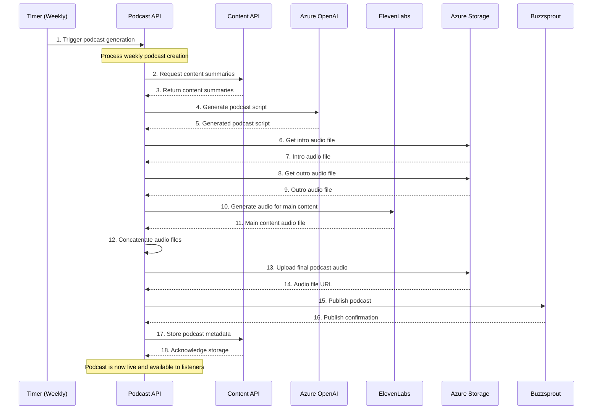

# Runtime view

## Content summarization

The content summarization flow is triggered based on an event called
`content.submissions.created.v1` that's published
by the content API and captured by the reader API.

The following sequence diagram illustrates the content summarization flow:

```mermaid
sequenceDiagram
    participant Portal
    participant ContentAPI as Content API
    participant ReaderAPI as Reader API
    participant AzureOpenAI as Azure OpenAI
    participant Storage as Storage

    Portal->>ContentAPI: 1. Submit content form
    Note over ContentAPI: Store content metadata
    ContentAPI-->>Portal: 2. Acknowledge receipt

    ContentAPI->>ReaderAPI: 3. Content received event
    Note over ReaderAPI: Process event

    ReaderAPI->>Storage: 4. Fetch content
    Storage-->>ReaderAPI: 5. Return content

    ReaderAPI->>AzureOpenAI: 6. Request summary
    AzureOpenAI-->>ReaderAPI: 7. Generated summary

    ReaderAPI->>ContentAPI: 8. Store summary
    ContentAPI-->>ReaderAPI: 9. Acknowledge storage

    Note over Portal: User can now view the summary
```

The flow is implemented as a workflow in the Reader API.

## Podcast generation

The podcast generation flow happens once per week on Friday at 18:00.
The reader API is triggered by a timer binding.

The following sequence diagram illustrates the podcast generation flow:

```mermaid
sequenceDiagram
    participant Timer as Timer (Weekly)
    participant PodcastAPI as Podcast API
    participant ContentAPI as Content API
    participant AzureOpenAI as Azure OpenAI
    participant ElevenLabs as ElevenLabs
    participant AzureStorage as Azure Storage
    participant Buzzsprout as Buzzsprout

    Timer->>PodcastAPI: 1. Trigger podcast generation
    Note over PodcastAPI: Process weekly podcast creation

    PodcastAPI->>ContentAPI: 2. Request content summaries
    ContentAPI-->>PodcastAPI: 3. Return content summaries

    PodcastAPI->>AzureOpenAI: 4. Generate podcast script
    AzureOpenAI-->>PodcastAPI: 5. Generated podcast script

    PodcastAPI->>AzureStorage: 6. Get intro audio file
    AzureStorage-->>PodcastAPI: 7. Intro audio file

    PodcastAPI->>AzureStorage: 8. Get outro audio file
    AzureStorage-->>PodcastAPI: 9. Outro audio file

    PodcastAPI->>ElevenLabs: 10. Generate audio for main content
    ElevenLabs-->>PodcastAPI: 11. Main content audio file

    PodcastAPI->>PodcastAPI: 12. Concatenate audio files

    PodcastAPI->>AzureStorage: 13. Upload final podcast audio
    AzureStorage-->>PodcastAPI: 14. Audio file URL

    PodcastAPI->>Buzzsprout: 15. Publish podcast
    Buzzsprout-->>PodcastAPI: 16. Publish confirmation

    PodcastAPI->>ContentAPI: 17. Store podcast metadata
    ContentAPI-->>PodcastAPI: 18. Acknowledge storage

    Note over PodcastAPI: Podcast is now live and available to listeners
```

The flow is implemented as a workflow in the Podcast API.
