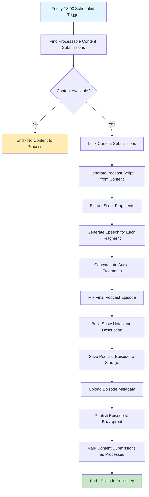

# Runtime view

## Generation of a weekly podcast

The podcast generation workflow is an automated process that runs weekly to create podcast episodes from summarized content submissions. The workflow is implemented using Temporal workflows for reliability and includes several stages from content selection to final publication.

### Workflow Overview

The podcast generation process follows these main steps:

1. **Scheduled Trigger**: Every Friday at 18:00, the `PodcastGenerationProcess` automatically starts the workflow
2. **Content Collection**: The system finds all processable content submissions from the past week
3. **Content Locking**: Selected submissions are locked to prevent duplicate processing
4. **Script Generation**: An AI-powered script generator creates a podcast script from the content submissions
5. **Audio Generation**: Text-to-speech conversion generates audio for each script fragment using configured host voices
6. **Audio Processing**: Individual audio fragments are concatenated and mixed into a final episode
7. **Publication**: The completed episode is saved with metadata (title, show notes, description) and uploaded to blob storage
8. **Buzzsprout Publishing**: The episode is automatically published to Buzzsprout podcast hosting platform
9. **Cleanup**: Processed content submissions are marked as completed

### Activity Diagram

### Implementation Details

- **Workflow Engine**: Uses Temporal for durable workflow execution with retry policies
- **Content Selection**: Queries for submissions with `SUMMARIZED` status within the date range
- **Script Generation**: Leverages Azure OpenAI to create conversational content between configured podcast hosts
- **Audio Generation**: Uses ElevenLabs API with voice clones for each podcast host
- **Storage**: Episodes are stored in Azure Blob Storage with episode metadata in the content database
- **Podcast Publishing**: Episodes are automatically published to Buzzsprout podcast hosting platform
- **Error Handling**: Each activity has configured retry policies for resilience against transient failures

The workflow ensures reliable podcast generation while handling failures gracefully through Temporal's built-in retry and recovery mechanisms.

## Processing Flow in reader-api

### Sequence Diagram

This sequence diagram illustrates the step-by-step flow of content processing in the `reader-api`, from user submission to updating the content service with the generated summary.

The `reader-api` is responsible for processing submitted content through a series of asynchronous steps, implemented as processing packages. The main flow is as follows:

1. **Content Downloading**
   - The `ContentDownloader` listens for new content submission events.
   - It downloads the content from the provided URL, parses it (using Tika), and emits a `ContentDownload` object containing the raw content and metadata.

2. **Content Summarization**
   - The `ContentSummarizer` receives the downloaded content.
   - It uses the `SummarizerAgent` (which leverages an LLM, e.g., Azure OpenAI) to generate a summary and actionable insights from the article body.
   - The result is emitted as a `ContentSummary` object.

3. **Content Submission Update**
   - The `ContentSubmissionUpdater` receives the summary.
   - It updates the original content submission in the content service via a GraphQL mutation, attaching the generated summary.

Each processing step is implemented as a Quarkus bean and connected via reactive messaging channels, enabling scalable and decoupled processing. Errors are logged and propagated as needed, and each step is designed to be idempotent and robust against transient failures.

This flow ensures that submitted content is automatically processed, summarized, and made available for further use (e.g., in podcast generation or user-facing summaries).
