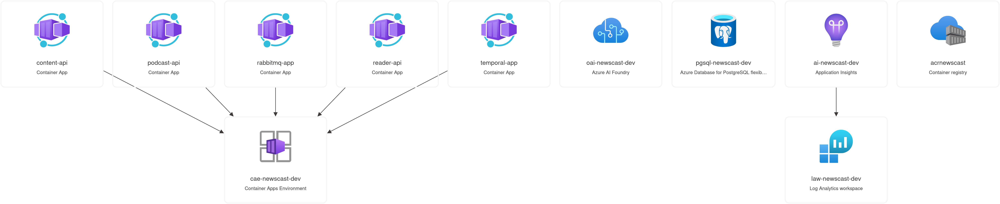
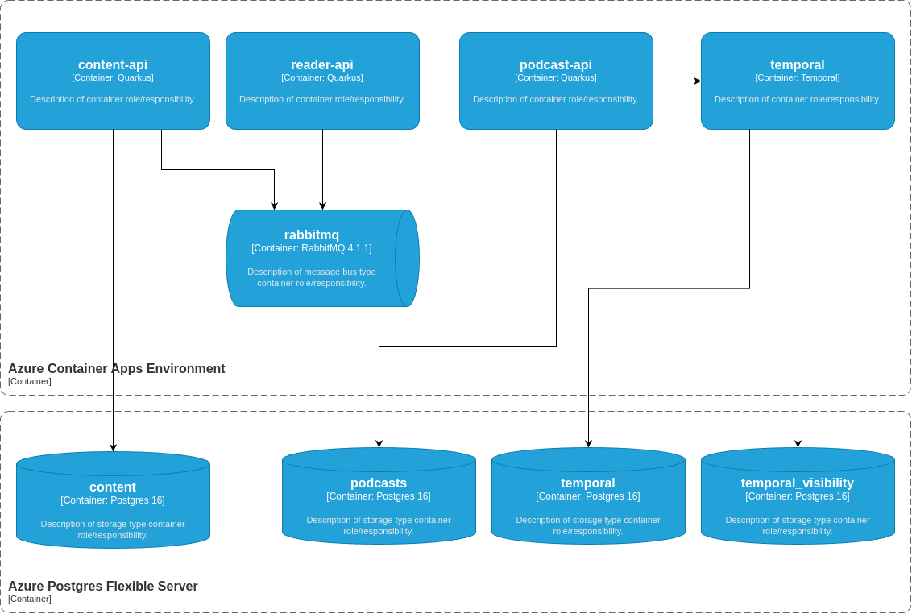

# Deployment view

This section covers how the application is deployed on Azure.

## Infrastructure resources

This application is deployed to Azure Container Apps and uses several Azure Platform-as-a-Service features. The following image shows an overview of the resources:

NOTE: The resources are postfixed with the environment name. In the diagram the dev environment is shown.

Each container app shown in the resources diagram uses a user assigned identity.

## Component dependencies

The following diagram shows the dependencies between container apps, RabbitMQ, and the Postgres databases.

## Resource groups

The application is deployed across two resource groups:

- `rg-newscast-<environment>`: The container apps and environment specific resources are deployed to a resource group postfixed with the environment name.
- `rg-newscast-shared`: The container registry needed for the container images, and a deployment identity are shared across all environment.

## Environments

We maintain two environments:

- Staging: Used to test changes before deploying them to production
- Production: The main production environment used to generate the weekly podcast

We can deploy more environments as needed by setting them up in Github and adding the necessary steps to the [.github/workflows/ci.yml](../../.github/workflows/ci.yml) workflow file.