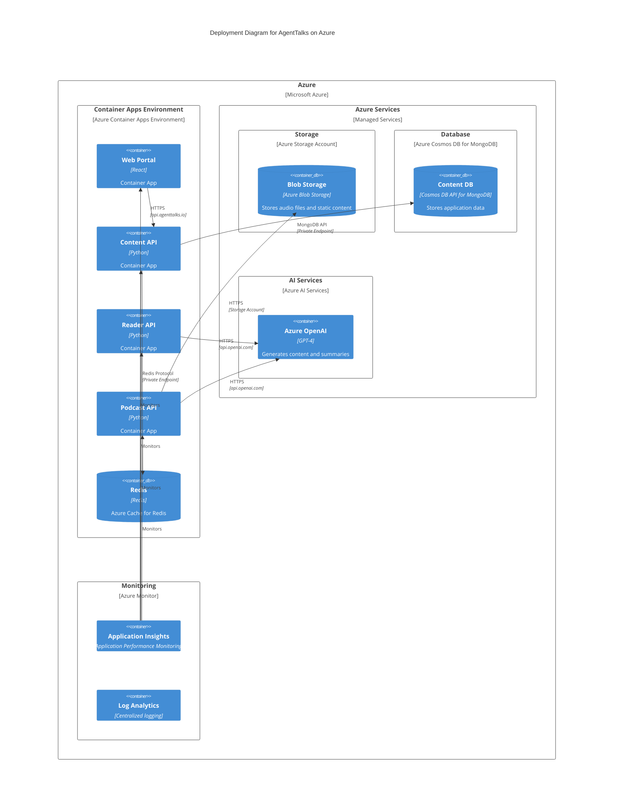

# Deployment view

This section covers the deployment of the system on Azure. Please refer to the building
blocks view to learn more about the specifics of each of the API components.

## Deployment Diagram

```mermaid
C4Deployment
title Deployment Diagram for AgentTalks on Azure

Deployment_Node(azure, "Azure", "Microsoft Azure") {
    Deployment_Node(container_env, "Container Apps Environment", "Azure Container Apps Environment") {
        Container(portal, "Web Portal", "React", "Container App")
        Container(content_api, "Content API", "Python", "Container App")
        Container(reader_api, "Reader API", "Python", "Container App")
        Container(podcast_api, "Podcast API", "Python", "Container App")
        ContainerDb(redis, "Redis", "Redis", "Azure Cache for Redis")
    }

    Deployment_Node(external_services, "Azure Services", "Managed Services") {
        Deployment_Node(storage, "Storage", "Azure Storage Account") {
            ContainerDb(blob_storage, "Blob Storage", "Azure Blob Storage", "Stores audio files and static content")
        }

        Deployment_Node(database, "Database", "Azure Cosmos DB for MongoDB") {
            ContainerDb(cosmos, "Content DB", "Cosmos DB API for MongoDB", "Stores application data")
        }

        Deployment_Node(ai, "AI Services", "Azure AI Services") {
            Container(openai, "Azure OpenAI", "GPT-4", "Generates content and summaries")
        }
    }

    Deployment_Node(monitoring, "Monitoring", "Azure Monitor") {
        Container(app_insights, "Application Insights", "Application Performance Monitoring")
        Container(log_analytics, "Log Analytics", "Centralized logging")
    }
}

%% Deployment_Node(external, "External Services", "Third-party Services") {
%%     Deployment_Node(buzzsprout, "Buzzsprout", "Podcast Hosting") {
%%         ContainerDb(buzzsprout_api, "Buzzsprout API", "REST API")
%%     }
%% }

Rel(portal, content_api, "HTTPS", "api.agenttalks.io")
Rel(content_api, cosmos, "MongoDB API", "Private Endpoint")
Rel(content_api, redis, "Redis Protocol", "Private Endpoint")
Rel(reader_api, openai, "HTTPS", "api.openai.com")
Rel(podcast_api, openai, "HTTPS", "api.openai.com")
Rel(podcast_api, blob_storage, "HTTPS", "Storage Account")
%% Rel(podcast_api, buzzsprout_api, "HTTPS", "www.buzzsprout.com/api")

Rel(app_insights, portal, "Monitors")
Rel(app_insights, content_api, "Monitors")
Rel(app_insights, reader_api, "Monitors")
Rel(app_insights, podcast_api, "Monitors")
```

## Deployment Components

### Azure Container Apps

- **Web Portal**: Hosts the React frontend
- **Content API**: Manages content and user data
- **Reader API**: Handles article processing and summarization
- **Podcast API**: Generates podcast content
- **Redis Cache**: Used for session management and caching

### Azure Services

- **Azure Cosmos DB**: MongoDB-compatible database for application data
- **Azure Blob Storage**: Stores audio files and static assets
- **Azure OpenAI**: Provides LLM capabilities for content generation
- **Azure Monitor**: Provides monitoring and logging

### External Services

- **Buzzsprout**: Podcast hosting and distribution platform

## Security

- Managed identities for service-to-service authentication
- Secrets stored in Azure Key Vault

## Monitoring and Operations

- Application Insights for application performance monitoring
- Log Analytics for centralized logging
- Azure Monitor alerts for critical metrics
- Automated scaling based on CPU/memory usage

## CI/CD

- GitHub Actions for build and deployment pipelines
- Infrastructure as Code using Bicep/ARM templates
- Automated testing and quality gates
- Blue/green deployments for zero-downtime updates
