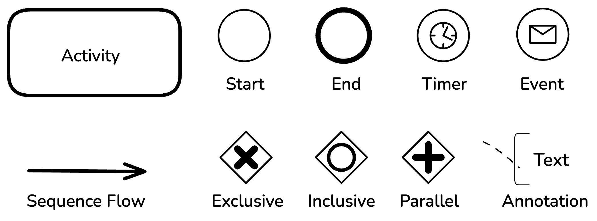

# Workflows

Long running processes in the application are implemented as Dapr workflows.
To build the workflows we follow a specific process. This process is explained in this
section of the documentation.

## Designing the workflow

We use [Camunda Modeler](https://camunda.com/download/modeler/) to design the workflow
using BPMN notation. To help keep workflows simple enough to understand, we limit the
complexity of the workflow to the following shapes:

Workflows can be started in two ways:

- Through a timer event
- By starting it manually

## Implementing the workflow

To help speed up the development of workflows we use the
[Workflow Composer](https://workflows.diagrid.io/). Workflow code can be generated from
the BPMN image by uploading it to the composer.

After generating the code, make sure to integrate the generated activities in the
API that will run the workflow.

### Input and output shapes

Make sure to use activity-specific inputs and outputs to pass data between activities.
We recommend generating these classes using copilot or windsurf.

### Activity implementation

The workflow is not allowed to make service calls. Any interaction with other components
in the system should happen through the activities.

Activities should be implemented in the API that will run the workflow.
